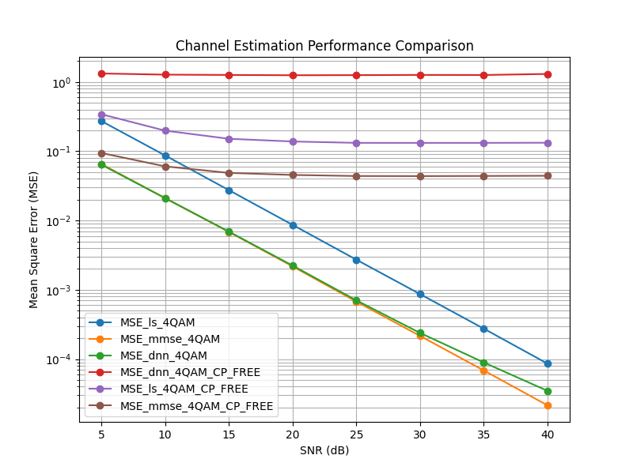
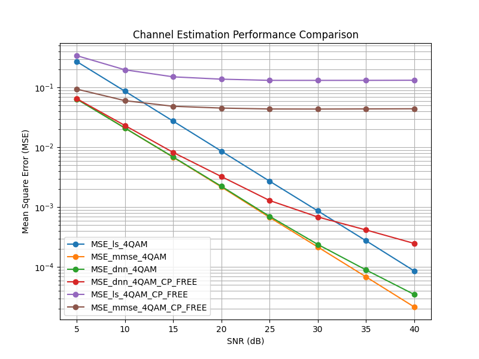

# 實驗 2.7：數據驅動之單輸入單輸出 (SISO-OFDM) 通道估計

本實驗旨在利用**深度神經網路 (Deep Neural Network, DNN)** 進行正交頻分複用 (OFDM) 系統中的通道估計，並與傳統的**最小平方法 (Least Square, LS)** 及**線性最小均方誤差 (LMMSE)** 方法進行性能對比。

實驗將涵蓋有、無**循環前綴 (Cyclic Prefix, CP)** 兩種場景，最終目標是繪製出六條 MSE 曲線，分析 AI 在理想與非理想干擾環境下的強健性。

## 實驗設置 (Experiment Setup)
本實驗模擬的 OFDM 系統參數如下：
* **子載波數量 $K$：** 64
* **導頻符元 (Pilot Symbol)：** 第 1 個 OFDM 符元（由 64 個 QPSK 調變的導頻組成）。
* **數據符元 (Data Symbol)：** 第 2 個 OFDM 符元（採用 64-QAM 調變）。
* **訊噪比範圍 (SNR Range)：** 5 dB 至 40 dB（以 5 dB 為步進）。
* **通道估計器：** * 基於 MLP 的 DNN 估計器。
    * 傳統 LMMSE 估計器（作為 Baseline）。
* **實驗場景：**
    * **With CP：** 理想條件，無符元間干擾 (ISI)。
    * **CP-Free：** 模擬嚴重干擾，展示 DNN 處理非線性失真的能力。

---

## 執行流程 (What You Need to Do)

| 步驟 | 說明 |
|-----------|---------|
| **產生channel** | 執行 `python generate_channel.py`|
| **訓練 DNN** | 在 `main.py` 設置 `ce_type = 'dnn'` 且 `test_ce = False`。執行腳本以在各個 SNR 下訓練模型。 |
| **評估 DNN** | 修改 `main.py` 為 `ce_type = 'dnn'` 且 `test_ce = True`。執行以計算並儲存 DNN 的 MSE 數據。 |
| **評估 LMMSE** | 修改 `main.py` 為 `ce_type = 'mmse'` 且 `test_ce = True`。執行以計算基準線 LMMSE 的性能。 |
| **評估 LS** | 修改 `main.py` 為 `ce_type = 'ls'` 且 `test_ce = True`。執行以計算基準線 LMMSE 的性能。 |
| **移除 CP 測試** | 若要重現虛線結果（無 CP 情況），請在 `main.py` 設置 `CP_flag = False` 並重複上述評估步驟。 |
| **繪製圖表** | 執行 `python plot_result.py`|

---

## 檔案結構說明 (Files)

| 檔案名稱 | 用途說明 |
|------|---------|
| `main.py` | 主程式腳本。用於配置實驗參數、啟動訓練迴圈以及在不同 SNR 下評估 MSE 性能。 |
| `tools/networks.py` | 核心神經網路定義。包含 `build_ce_dnn` 函數，定義 MLP 架構並使用 TensorFlow 1.x 進行訓練。 |
| `tools/raputil.py` | 工具函式庫。包含 `MMSE_CE` 演算法實作、數據生成器 `sample_gen` 等關鍵函式。 |
| `tools/shrinkage.py` | 實作軟閾值 (Soft-thresholding) 函數，用於提升估計結果的稀疏特性。 |
| `dnn_ce/` | (需手動建立) 用於存放訓練好的模型權重檔 (`.npz`)。 |

---

## 技術補充與提醒 (Notes & Troubleshooting)

### 1. 關於軟閾值 (Soft-thresholding)
在 `networks.py` 中使用了 `shrinkage.py` 的功能。這是在模擬壓縮感知 (Compressive Sensing) 的概念。對於稀疏通道，適當的 `theta` 參數能過濾雜訊，但若 `theta` 過大（如 0.3），可能會導致高 SNR 下的 MSE 無法下降（出現 Error Floor）。

### 2. 常見錯誤排除
* **FileNotFoundError**: 原始專案內並沒有 `dnn_ce` 資料夾，模型無法儲存，會產生"FileNotFoundError"，請自行創建。
* **ValueError (Broadcast)**: 若出現維度不匹配，請檢查 `channel_train.npy` 的長度是否與 `CP` 長度對齊。

### 3. 性能預期
在 **CP-Free** 場景下，傳統 LS 與 MMSE 會因為嚴重的 ISI 而導致 MSE 表現大幅下降，此時訓練良好的 DNN 通常展現出更強的魯棒性（Robustness），曲線會明顯低於傳統方法。

## 實驗結果
一開始我訓練完DNN之後發現，在沒有CP的情況下DNN的表現甚至比MMSE和LS來的差，後來才發現這是因為我在訓練模型時，使用的是有CP的資料，這導致DNN模型在遇到沒有CP會產生的ISI(Inter-Symbol Interference)時，表現特別差。

所以後來我又用沒有CP的資料訓練了一個模型，結果顯示與預期的相同，DNN在沒有CP時會比傳統的MMSE和LS有更好的魯棒性(Robustness)。
